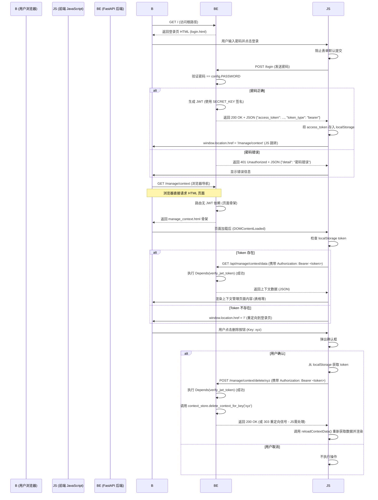

# Gemini API 代理上下文管理与 Web UI 认证方案 (v1.3.0 实现状态)

## 1. 目标

*   解决当前 Gemini API 代理在多 Key 轮询模式下无法保持对话上下文的问题。
*   实现一个**默认基于内存、可选文件持久化**的、支持多租户（基于认证凭证）的上下文管理机制。
*   解决 Web UI 在 Hugging Face Spaces 环境下因 Session Cookie 丢失导致的登录持久性问题，提供一个更健壮、更标准、对部署环境不敏感的 Web UI 认证机制 (JWT)。
*   严格保持对 OpenAI Chat Completions API 规范的兼容性。
*   兼容 Docker 及 Hugging Face Space 部署环境。
*   精简管理后台功能，移除不再必要的代理 Key 管理 UI。
*   优化代码结构，将认证相关逻辑拆分到独立模块。

## 2. 核心方案：基于认证凭证的上下文管理 + JWT Web UI 认证

### 2.1 上下文管理

采用**客户端提供的认证凭证**作为区分不同对话上下文的标识符。

*   **API 认证:** 客户端调用 API (`/v1/...`) 时，在 HTTP Header 中提供 `Authorization: Bearer <token>` 进行认证。
    *   **内存模式 (默认):** `<token>` 必须是 `PASSWORD` 环境变量的值。
    *   **文件模式 (设置 `CONTEXT_DB_PATH`):** `<token>` 必须是 `proxy_keys` 表中存在的有效代理 Key。
*   **上下文标识:** 使用验证通过的 `<token>` (即 `PASSWORD` 或数据库中的 `proxy_key`) 作为该次请求关联的上下文 ID。
*   **上下文隔离:** 每个有效的认证凭证对应一套独立的对话历史上下文。
*   **兼容性:** API 的请求体和响应体格式严格遵守 OpenAI 规范。

### 2.2 Web UI 认证 (JWT)

放弃 Web UI 的 Session Cookie 机制，采用基于 Token 的认证 (JWT)。

*   **登录流程:**
    1.  用户在 Web UI (`/`) 输入 `PASSWORD`。
    2.  前端 JS 异步提交密码到后端 `POST /login` 端点。
    3.  后端验证 `PASSWORD`。
    4.  验证成功后，后端使用 `SECRET_KEY` 签发一个有时效性的 JWT。
    5.  后端将 JWT 返回给前端。
    6.  前端 JS 将 JWT 存储在浏览器 `localStorage`。
    7.  前端 JS 重定向用户到管理页面 (`/manage/context`)。
*   **后续 Web UI 页面/API 访问认证:**
    1.  用户访问受保护的管理页面或前端 JS 调用受保护的管理 API (e.g., `/api/manage/context/data`, `/manage/context/delete/...`)。
    2.  前端 JS 从 `localStorage` 读取 JWT，并将其添加到请求的 `Authorization: Bearer <token>` 头中。
    3.  后端应用 FastAPI 依赖项 (`verify_jwt_token`) 到这些路由/API。
    4.  该依赖项验证 `Authorization` 头中的 JWT。
    5.  如果 Token 有效，允许访问/处理请求。
    6.  如果 Token 无效或缺失，返回 401/403 错误，前端 JS 应处理此错误（例如，清除 token 并重定向到登录页）。

## 3. 存储 (SQLite)

*   **技术选型:** SQLite 数据库。
*   **数据库文件:** **默认使用内存数据库** (`file::memory:?cache=shared`)。可通过 `CONTEXT_DB_PATH` 环境变量指定文件路径以启用**可选的文件持久化存储**。
*   **存储持久性说明:**
    *   **文件模式:** 将 `CONTEXT_DB_PATH` 指向持久化存储位置时，上下文将持久保存。
    *   **内存模式 (默认, HF Spaces 免费层):** 上下文存储在内存中，**重启后会丢失**。提供的是临时的、会话级别的上下文保持。**通过单一共享连接确保请求间数据一致性**。
*   **数据库表结构:**
    *   `proxy_keys`: 存储代理 Key 信息 (主要用于文件模式下的 API 认证)。
        *   `key TEXT PRIMARY KEY`
        *   `description TEXT`
        *   `created_at TIMESTAMP DEFAULT CURRENT_TIMESTAMP`
        *   `is_active BOOLEAN DEFAULT TRUE`
    *   `contexts`: 存储对话上下文历史。
        *   `proxy_key TEXT PRIMARY KEY`: 关联的认证凭证 (PASSWORD 或 DB Key)。
        *   `contents TEXT NOT NULL`: 对话历史 JSON 字符串。
        *   `last_used TIMESTAMP DEFAULT CURRENT_TIMESTAMP`
        *   *外键约束:* `FOREIGN KEY(proxy_key) REFERENCES proxy_keys(key) ON DELETE CASCADE` (在 `save_context` 中通过 `INSERT OR IGNORE` 保证 Key 存在)。
    *   `settings`: 存储全局配置项。
        *   `key TEXT PRIMARY KEY` (例如: `"context_ttl_days"`)
        *   `value TEXT NOT NULL`

## 4. 代理 Key 管理 (主要用于文件模式)

*   **存储:** 代理 Key 存储在 SQLite 的 `proxy_keys` 表中。
*   **管理:**
    *   **文件模式 (设置 `CONTEXT_DB_PATH`):** **已实现 Web 管理界面 (`/manage/keys`)**，用于增、删、改（描述、状态）、查数据库中的代理 Key。需要管理员通过 JWT 认证登录。提供“生成新 Key”的功能。
    *   **内存模式:** 不使用此表进行 API 认证 (使用 `PASSWORD`)，因此**不提供**此 Web UI 管理功能。

## 5. 上下文管理逻辑

*   **存储:** 对话历史存储在 `contexts` 表中，与认证凭证关联。
*   **加载/保存:**
    *   在 `process_request` 中，根据验证通过的认证凭证 (`proxy_key` 变量) 从 `contexts` 表加载历史。
    *   在 API 调用成功后，将回复追加到上下文中，写回 `contexts` 表，更新 `last_used`。**在保存前会确保关联的 Key 存在于 `proxy_keys` 表中**。
    *   **流式响应保存行为:** 受 `STREAM_SAVE_REPLY` 环境变量控制。默认为 `false`，仅保存用户输入和模型回复占位符；设为 `true` 时，会尝试保存包含完整模型回复的上下文。
*   **Token 估算:** *实现细节依赖 `estimate_token_count` 函数。*
*   **截断逻辑 (模型感知):** (已实现)
    *   基于 `model_limits.json` 中的 `input_token_limit` 或 `DEFAULT_MAX_CONTEXT_TOKENS` 回退值，减去 `CONTEXT_TOKEN_SAFETY_MARGIN`。
    *   超过阈值时，从 `contents` 列表开头成对移除旧消息。
    *   处理单条消息超限的情况。
*   **TTL 自动清理:** (已实现)
    *   基于 `contexts.last_used` 和 `settings` 表中的 `context_ttl_days`。
    *   默认 TTL 为 7 天。
    *   在 `load_context` 中检查并删除过期记录。
*   **内存记录数限制 (新增):** (已实现)
    *   **仅在内存模式下生效**。
    *   通过 `MAX_CONTEXT_RECORDS_MEMORY` 环境变量配置（默认 5000）。
    *   在 `save_context` 中，如果记录数超过限制，则**删除 `last_used` 最早的记录**，将总数维持在限制附近。

## 6. Web 管理界面

*   **访问路径:** `/manage` (重定向到 `/manage/context`)。需要先通过 `/` 路径使用 `PASSWORD` 登录。
*   **认证:** **使用 JWT (JSON Web Token) 进行认证。** 需要 `PASSWORD` (登录验证) 和 `SECRET_KEY` (JWT 签名)。登录通过 `/login` 端点完成，后续管理操作的 API 调用需在 Header 中携带 `Authorization: Bearer <jwt_token>`。
*   **功能:**
    *   **代理 Key 管理 (`/manage/keys`):** (**已实现，仅在文件模式下可用**)
        *   查看代理 Key 列表 (Key, 描述, 创建时间, 状态)。
        *   添加新 Key（自动生成 UUID 或允许用户自定义，需校验唯一性）。
        *   编辑 Key 的描述。
        *   启用/禁用 Key (`is_active` 状态)。
        *   删除 Key (应有确认提示，并级联删除关联的上下文)。
    *   **上下文管理 (`/manage/context`):** (已实现)
        *   查看当前 TTL 设置并修改 (通过 JS `fetch` + JWT)。
        *   按认证凭证查看上下文记录（显示 Key、内容长度、最后使用时间）。数据通过 `/api/manage/context/data` (JWT 保护) 获取。
        *   按认证凭证删除指定的上下文记录 (通过 JS `fetch` + JWT)。
        *   **新增刷新按钮**，用于手动更新列表。
*   **技术栈:** FastAPI, Jinja2 模板引擎, JavaScript (`fetch` API)。
*   **安全:**
    *   服务端对表单输入进行验证。
    *   **已实现 CSRF 防护 (v1.3.0):** 使用 `fastapi-csrf-protect` 库为所有 Web UI 表单和需要修改状态的 AJAX 请求添加了 CSRF 保护。

## 7. JWT 认证流程示意图 (Mermaid)

## 8. 配置

*   **环境变量 (必需):**
    *   `GEMINI_API_KEYS`: Google Gemini API Key 列表。
    *   `PASSWORD`: 用于 Web UI 登录 **和** 内存模式下的 API 认证。
    *   `SECRET_KEY`: 用于 JWT 签名的强随机密钥。
*   **环境变量 (可选):**
    *   `CONTEXT_DB_PATH`: SQLite 数据库文件路径 (不设置则使用内存数据库)。
    *   `DEFAULT_MAX_CONTEXT_TOKENS`: 回退 Token 限制 (默认: `30000`)。
    *   `CONTEXT_TOKEN_SAFETY_MARGIN`: Token 安全边际 (默认: `200`)。
    *   `MAX_REQUESTS_PER_MINUTE`: 本地 RPM 限制 (默认 30)。
    *   `MAX_REQUESTS_PER_DAY_PER_IP`: 本地每日 IP 请求限制 (默认 600)。
    *   `DISABLE_SAFETY_FILTERING`: 是否全局禁用安全过滤 (默认 false)。
    *   `JWT_ALGORITHM`: JWT 算法 (默认 HS256)。
    *   `ACCESS_TOKEN_EXPIRE_MINUTES`: JWT 有效期 (分钟, 默认 30)。
    *   `USAGE_REPORT_INTERVAL_MINUTES`: 使用报告间隔 (分钟, 默认 30)。
    *   `REPORT_LOG_LEVEL`: 使用报告日志级别 (默认 INFO)。
    *   `CACHE_REFRESH_INTERVAL_SECONDS`: Key 分数缓存刷新间隔 (秒, 默认 10)。
    *   `MEMORY_CONTEXT_CLEANUP_INTERVAL_SECONDS`: 内存上下文清理间隔 (秒, 默认 3600)。
    *   `MAX_CONTEXT_RECORDS_MEMORY`: 内存上下文最大记录数 (默认 5000)。
    *   `STREAM_SAVE_REPLY`: (可选) 是否在流式响应后保存模型回复 (默认 false)。
*   **文件配置:**
    *   `app/data/model_limits.json`: **需要扩展**，为相关模型添加 `input_token_limit` 字段。
*   **数据库配置:**
    *   上下文 TTL 默认值在代码中设置 (7 天)，实际值存储在 SQLite `settings` 表中，可通过 Web UI 修改。

## 9. 部署

*   **依赖 (`requirements.txt`):** 需要添加/确认 `fastapi`, `uvicorn[standard]`, `python-dotenv`, `httpx`, `starlette`, `jinja2`, `python-multipart`, **`python-jose[cryptography]`**, **`fastapi-csrf-protect`**。
*   **Docker:** 确保应用有权限写入数据库文件所在的目录 (如果使用文件模式)。
*   **Hugging Face Space:** 配置所需的环境变量 (Secrets)。**注意内存模式的非持久性**。**建议配置 `--workers 1` 以确保内存数据库一致性**。
*   **单 Worker 建议:** 在使用内存数据库时，强烈建议配置 Uvicorn 或 Gunicorn 只使用单个工作进程 (`--workers 1`)，以避免多进程访问共享内存数据库可能导致的状态不一致问题。

## 10. 用户责任

*   文档需明确强调：用户必须为每个独立的对话/任务使用**不同**的认证凭证（内存模式下是不同的 `PASSWORD` 值——但这不现实，所以内存模式下所有 API 调用共享上下文；文件模式下是不同的数据库代理 Key），以保证上下文隔离。

## 11. 文档 (`readme.md`)

*   **已更新**以反映 JWT 认证、**新增的 Key 管理 UI (文件模式)**、内存模式默认行为、新增配置项 (`STREAM_SAVE_REPLY`) 等。

## 12. 测试策略

*   **HF Spaces (内存模式):** 重点测试 Web UI 登录流程是否顺畅，JWT 是否能正确生成、存储和用于后续管理 API 调用（通过后端依赖验证）。同时验证 API 调用（使用 `PASSWORD`）是否正常，上下文是否能正确保存和显示。
*   **本地 (文件模式):** 验证 Web UI 登录流程。验证 API 调用（使用数据库代理 Key）是否正常，上下文是否能正确保存和显示。测试手动管理 `proxy_keys` 表后的 API 认证。