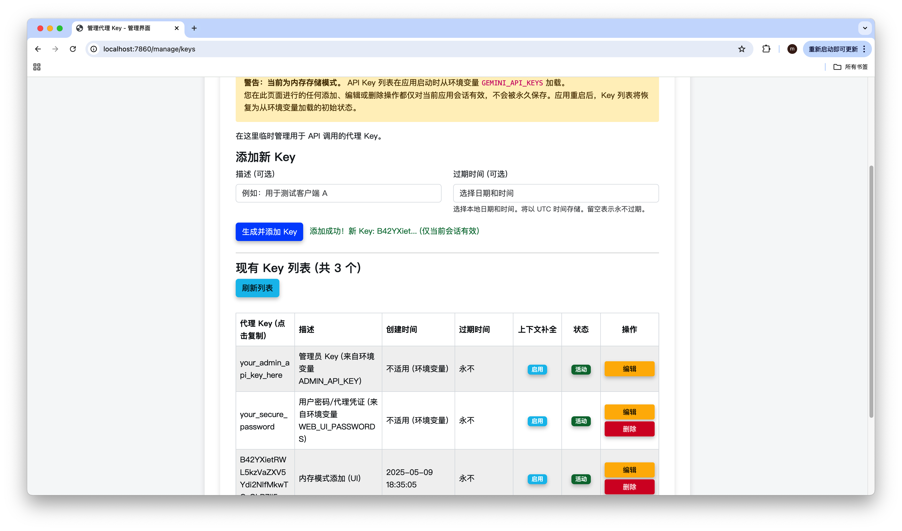

# 🚀 Gemini API 代理

<!-- 在这里添加徽章 (Badges) -->
<!-- 例如: [](...) -->
[](https://creativecommons.org/licenses/by-nc/4.0/)

本项目 fork 自 [Mrjwj34](https://github.com/Mrjwj34/Hagemi) 的项目进行二次开发（全程使用 AI 编码，模型主要是 Gemini-2.5-pro-exp-03-25）。

这是一个基于 FastAPI 构建的 Gemini API 代理，旨在提供一个简单、安全且可配置的方式来访问 Google 的 Gemini 模型。适用于在 Hugging Face Spaces 上部署，并支持 OpenAI API 格式的工具集成。

## 目录

- [✨ 主要功能](#-主要功能)
- [🛠️ 使用方式](#️-使用方式)
  - [🚀 部署到 Hugging Face Spaces](#-部署到-hugging-face-spaces)
  - [💻 本地运行](#-本地运行)
  - [🔌 接入其他服务](#-接入其他服务)
- [API 接口说明](#-api-接口说明)
- [⚠️ 注意事项](#️-注意事项)
- [🤝 贡献](#-贡献)
- [📜 许可证](#-许可证)
- [📜 版本历史](#-版本历史)

## ✨ 主要功能

<details>
<summary>点击展开/折叠详细功能列表</summary>

### 🔑 API 密钥轮询和管理
*   支持配置多个 Gemini API 密钥，并进行轮询调用。
*   自动检测并移除无效或权限不足的 API 密钥，避免重复尝试 (已修复线程安全问题)。
*   随机化密钥栈，提高负载均衡性能。
*   自动在请求失败时切换到下一个可用密钥。
*   启动时显示所有API密钥状态，方便监控和管理。
*   详细的API密钥使用日志，记录每个密钥的使用情况和错误信息。

### 📊 API 使用情况跟踪与智能选择 (v1.2.0 & v1.2.1 优化)
*   **使用情况跟踪**: 在程序内存中跟踪每个 API Key 对每个已知模型的 RPM (每分钟请求数), RPD (每日请求数), TPD_Input (每日输入 Token 数), TPM_Input (每分钟输入 Token 数) 使用情况。
    *   TPM_Input 计数同时支持流式和非流式响应。
    *   依赖 `app/data/model_limits.json` 文件定义各模型的限制 (已更新以包含输入 Token 限制)。
*   **每日重置**: RPD 和 TPD_Input 计数根据太平洋时间 (PT) 在每日午夜自动重置。
*   **周期性报告与建议**: 定期（默认每 30 分钟，可通过 `USAGE_REPORT_INTERVAL_MINUTES` 环境变量配置）在日志文件中输出各 Key、各模型的使用情况、估算的剩余额度，并根据用量趋势提供 Key 池数量调整建议 (报告内容已更新以包含输入 Token 指标，建议逻辑已调整)。报告的日志级别可通过 `REPORT_LOG_LEVEL` 环境变量配置（默认为 INFO），方便在特定环境（如 Hugging Face Spaces中设为WARNING才能在终端日志中谁出）中查看。
*   **智能 Key 选择**: 基于各 Key 对目标模型的健康度评分（综合 RPD, TPD_Input, RPM, TPM_Input 剩余百分比，权重已调整）进行智能选择，优化 Key 利用率。评分缓存会定期自动更新。
*   **本地速率预检查**: 在请求发送给 Gemini 前，会根据本地跟踪的使用情况和模型限制进行预检查 (RPD, TPD_Input, RPM, TPM_Input)，若判断超限则提前切换 Key，减少对 API 的无效请求。

### 📊 术语解释
*   **RPD (Requests Per Day)**: 指每个 API 密钥每天允许的最大请求次数。这是 Gemini API 对每个密钥设定的日请求总量限制。
*   **RPM (Requests Per Minute)**: 指每个 API 密钥每分钟允许的最大请求次数。这是 Gemini API 对请求频率的限制。
*   **TPD_Input (Input Tokens Per Day)**: 指每个 API 密钥每天允许处理的最大 *输入* Token 总数。
*   **TPM_Input (Input Tokens Per Minute)**: 指每个 API 密钥每分钟允许处理的最大 *输入* Token 总数。

    *本代理程序会跟踪这些指标，用于智能选择可用密钥并进行本地速率预检查。*

### 模型列表接口
*   提供 `/v1/models` 接口，返回可用的 Gemini 模型列表。
*   自动检测并显示当前 API 密钥支持的所有模型。

### 💬 聊天补全接口：
*   提供 `/v1/chat/completions` 接口，支持流式（streaming）和非流式响应，与 OpenAI API 格式兼容。
*   自动将 OpenAI 格式的请求转换为 Gemini 格式。
*   支持多种 Gemini 模型，包括最新的 Gemini 2.5 Pro 系列。
*   自定义安全设置，解除内容限制。可通过 `DISABLE_SAFETY_FILTERING` 环境变量全局禁用安全过滤。

### 🖼️ 图片输入处理 (v1.2.0 优化)
*   支持 OpenAI 格式的多模态消息中的图片输入。
*   **仅接受** Base64 编码的 Data URI 格式 (`data:image/...;base64,...`)。
*   **增强验证**: 使用正则表达式解析 Data URI，并验证 MIME 类型是否为 Gemini 支持的格式 (JPEG, PNG, WebP, HEIC, HEIF)，提高了处理健壮性。

### 📝 日志系统：
*   完善的日志记录系统，包括应用日志、错误日志和访问日志。
*   支持日志轮转功能，防止日志文件过大：
    *   基于大小的轮转：当日志文件达到指定大小时自动创建新文件。
    *   基于时间的轮转：按照指定的时间间隔（如每天午夜）自动创建新文件。
*   自动清理过期日志文件，默认保留30天，减少磁盘空间占用。
*   详细记录API请求、响应和错误信息，便于问题排查。
*   可通过环境变量自定义日志配置：
    *   `MAX_LOG_SIZE`：单个日志文件最大大小（默认10MB）。
    *   `MAX_LOG_BACKUPS`：保留的日志文件备份数量（默认5个）。
    *   `LOG_ROTATION_INTERVAL`：日志轮转间隔（默认每天午夜）。
    *   `DEBUG`：设置为 "true" 启用详细日志记录。

### 🔒 API 密钥保护（可选）：
*   通过 `PASSWORD` 环境变量设置 API 密钥。
*   提供默认 API 密钥 `"123"`。

### 🚦 速率限制和防滥用：
*   通过环境变量自定义限制：
    *   `MAX_REQUESTS_PER_MINUTE`：每分钟最大请求数（默认 30）。
    *   `MAX_REQUESTS_PER_DAY_PER_IP`：每天每个 IP 最大请求数（默认 600）。
*   超过速率限制时返回 429 错误。
*   修复了速率限制逻辑中的缩进错误 (v1.2.0)。

### ⚙️ 安全过滤控制（可选）：
*   通过 `DISABLE_SAFETY_FILTERING` 环境变量控制是否全局禁用 Gemini API 的安全过滤。
*   设置为 `"true"` 将对所有请求禁用安全过滤（使用 `OFF` 阈值）。
*   默认为 `"false"`，不进行全局禁用。
*   **警告：** 禁用安全过滤可能会导致模型生成不当或有害内容，请谨慎使用。

### 🧩 服务兼容
*   提供的接口与 OpenAI API 格式兼容,便于接入各种服务。
*   支持各种基于 OpenAI API 的应用程序和工具。
*   增强的兼容性处理，支持多种客户端（如Chatbox、Roo Code等）：
    *   空消息检查：自动检测并处理空messages数组，返回友好的错误信息。
    *   多模态支持：Message模型支持content字段为字符串或字典列表，兼容图片等多模态输入。
    *   增强的日志记录：详细记录请求体内容，便于调试客户端兼容性问题。
    *   模型名称验证：启动时记录可用模型列表，确保客户端使用正确的模型名称。

*   **上下文管理 (v1.3.0 新增)**:
    *   支持基于认证凭证 (`Authorization: Bearer <credential>`) 的多轮对话上下文保持。在内存模式下，此凭证是 `PASSWORD` 环境变量中的某个值；在文件模式下，是数据库中的代理 Key。
    *   使用 SQLite 进行上下文存储。**默认使用内存模式** (`:memory:`)，适用于 HF Spaces 免费层（重启丢失数据）。可通过 `CONTEXT_DB_PATH` 环境变量启用**文件持久化存储**。
    *   根据模型 `input_token_limit` (在 `model_limits.json` 中配置) 自动截断过长的上下文。
    *   内存模式下，会定期自动清理超过 TTL 设置的旧上下文，防止内存溢出。
    *   提供 Web 管理界面 (`/manage`) 用于管理上下文（查看、删除、配置 TTL）。
    *   **新增 (文件模式):** 提供 `/manage/keys` 界面，用于在**文件存储模式** (`CONTEXT_DB_PATH` 已设置) 下管理代理 Key (添加、启用/禁用、删除)。
    *   **清除上下文:** 可在 `/manage/context` Web 界面中选择并删除特定 Key 关联的对话历史。


    *   **⚠️ 重要提醒:** 上下文与 `Authorization` Header 中提供的凭证严格绑定。
        *   在**内存模式**下，此凭证是 `PASSWORD` 环境变量中配置的**某个**值。
        *   在**文件模式**下，此凭证是数据库中有效的代理 Key。
        **为不同的对话或任务使用相同的凭证会导致上下文混淆！请务必为每个独立的对话/任务使用不同的凭证 (即在内存模式下使用不同的密码，或在文件模式下使用不同的代理 Key)。**




</details>

## 🛠️ 使用方式

### 🚀 部署到 Hugging Face Spaces：

1.  创建一个新的 Space。
2.  将本项目代码上传到 Space。
3.  在 Space 的 `Settings` -> `Secrets` 中设置以下环境变量：

    | 环境变量                                | 说明                                                                                                                               | 默认值/示例                               |
    | --------------------------------------- | ---------------------------------------------------------------------------------------------------------------------------------- | ----------------------------------------- |
    | `GEMINI_API_KEYS`                       | **（必需）** 你的 Gemini API 密钥，用逗号分隔。                                                                                       | `key1,key2,key3`                          |
    | `ADMIN_API_KEY`                         | **（必需）** 中转服务管理员 API Key，用于管理所有上下文和 Key（文件模式）。拥有最高权限。 | `your_admin_api_key_here`                 |
    | `PASSWORD`                              | （可选）设置服务的 API 密钥（用于内存模式认证和 Web UI 登录）。**在内存模式下，支持逗号分隔配置多个 Key，每个 Key 对应一个独立的用户和上下文。** | `"123,password2,password3"`               |
    | `SECRET_KEY`                            | **（必需）** 用于 Web UI Session 和 JWT 加密的密钥。请设置一个长而随机的字符串。                                                          |                                           |
    | `MAX_REQUESTS_PER_MINUTE`               | （可选）每分钟最大请求数。                                                                                                           | `30`                                      |
    | `MAX_REQUESTS_PER_DAY_PER_IP`           | （可选）每天每个 IP 最大请求数。                                                                                                       | `600`                                     |
    | `MAX_LOG_SIZE`                          | （可选）单个日志文件最大大小（MB）。                                                                                                   | `10`                                      |
    | `MAX_LOG_BACKUPS`                       | （可选）保留的日志文件备份数量。                                                                                                       | `5`                                       |
    | `LOG_ROTATION_INTERVAL`                 | （可选）日志轮转间隔。                                                                                                               | `midnight`                                |
    | `DEBUG`                                 | （可选）设置为 `"true"` 启用详细日志记录。                                                                                             | `false`                                   |
    | `DISABLE_SAFETY_FILTERING`              | （可选）设置为 `"true"` 将全局禁用 Gemini API 的安全过滤。**警告：** 可能导致不当内容。                                                    | `false`                                   |
    | `USAGE_REPORT_INTERVAL_MINUTES`         | （可选）周期性使用情况报告的间隔时间（分钟）。                                                                                         | `30`                                      |
    | `REPORT_LOG_LEVEL`                      | （可选）周期性报告的日志级别（DEBUG, INFO, WARNING, ERROR, CRITICAL）。设为 `WARNING` 可在 HF Logs 显示。                               | `INFO`                                    |
    | `PROTECT_STATUS_PAGE`                   | （可选）设置为 `"true"` 将对根路径 `/` 的状态页面启用密码保护（使用 `PASSWORD`）。                                                       | `false`                                   |
    | `CONTEXT_DB_PATH`                       | （可选）设置此路径以启用基于文件的 SQLite 存储。**未设置则使用内存数据库 (`:memory:`)。**                                                |                                           |
    | `DEFAULT_MAX_CONTEXT_TOKENS`            | （可选）当模型未在 `model_limits.json` 中定义时的回退 Token 限制。                                                                     | `30000`                                   |
    | `CONTEXT_TOKEN_SAFETY_MARGIN`           | （可选）从模型 `input_token_limit` 减去的安全边际。                                                                                    | `200`                                     |
    | `MEMORY_CONTEXT_CLEANUP_INTERVAL_SECONDS` | （可选）内存数据库模式下，后台清理任务的运行间隔（秒）。                                                                                 | `3600`                                    |
    | `MAX_CONTEXT_RECORDS_MEMORY`            | （可选）内存数据库模式下，允许存储的最大上下文记录条数。                                                                                 | `5000`                                    |
    | `JWT_ALGORITHM`                         | （可选）JWT 签名算法。                                                                                                               | `HS256`                                   |
    | `ACCESS_TOKEN_EXPIRE_MINUTES`           | （可选）Web UI 登录 JWT 的有效期（分钟）。                                                                                             | `30`                                      |
    | `CACHE_REFRESH_INTERVAL_SECONDS`        | （可选）Key 分数缓存刷新间隔（秒）。                                                                                                   | `10`                                      |
    | `STREAM_SAVE_REPLY`                     | （可选）设置为 `"true"` 时，流式响应结束后会尝试保存包含模型回复的完整上下文。                                                              | `false`                                   |
4.  **（重要）扩展 `app/data/model_limits.json`**: 确保此文件存在，并且为需要进行上下文截断的模型添加了 `"input_token_limit"` 字段（参考 Google 官方文档）。
5.  确保 `requirements.txt` 文件已包含必要的依赖 (`jinja2`, `starlette[full]` 等)。
6.  Space 将会自动构建并运行。
7.  URL格式为`https://your-space-url.hf.space`。

### 💻 本地运行：
1.  克隆项目代码到本地。
2.  安装依赖：`pip install -r requirements.txt` (确保包含 `python-multipart` 等以支持所有功能)
3.  **（重要）创建并扩展模型限制文件：** 在 `app/data/` 目录下创建 `model_limits.json` 文件。定义模型的 RPM, RPD, TPD_Input, TPM_Input 限制，并且**为需要进行上下文截断的模型添加 `"input_token_limit"` 字段**（参考 Google 官方文档）。示例：
    ```json
    {
      "gemini-1.5-flash-latest": {"rpm": 15, "tpm_input": 1000000, "rpd": 1500, "tpd_input": null, "input_token_limit": 1048576},
      "gemini-1.5-pro-latest": {"rpm": 2, "tpm_input": 32000, "rpd": 50, "tpd_input": null, "input_token_limit": 2097152}
      // ... 其他模型
    }
    ```
4.  **配置环境变量：**
    *   **（推荐）** 在项目根目录创建 `.env` 文件，并填入以下内容（根据需要取消注释并修改）：
      下面是一个 `.env` 文件内容的示例。请根据需要取消注释并修改值。**详细的环境变量说明请参考上方“部署到 Hugging Face Spaces”部分的表格。**
      ```dotenv
      # .env 文件示例
      
      # (必需) Gemini API 密钥，逗号分隔
      GEMINI_API_KEYS=YOUR_API_KEY_1,YOUR_API_KEY_2
      
      # (必需) Web UI 和 JWT 密钥
      SECRET_KEY=your_very_strong_random_secret_key_here
      
      # (可选) 服务 API 密钥 (内存模式认证 & Web UI 登录)
      # 在内存模式下，支持逗号分隔配置多个 Key，每个 Key 对应一个独立的用户和上下文。
      PASSWORD="123,password2,password3"
      
      # (可选) 启用文件存储上下文 (否则使用内存)
      # CONTEXT_DB_PATH=app/data/context_store.db
      
      # (可选) 启用调试日志
      # DEBUG=true
      
      # (可选) 禁用安全过滤 (谨慎使用!)
      # DISABLE_SAFETY_FILTERING=true
      
      # ... 其他可选环境变量参考上方表格 ...
      ```
    *   **（或者）** 直接在终端设置环境变量（仅对当前会话有效）：
      ```bash
      export GEMINI_API_KEYS="key1,key2"
      export SECRET_KEY="your_secret"
      export PASSWORD="your_password"
      # ... 其他环境变量
      ```
5.  运行：`uvicorn app.main:app --reload --host 0.0.0.0 --port 7860`

### 🔌 接入其他服务

1.  在连接中选择 OpenAI。
2.  在 API Base URL 中填入 `https://your-space-url.hf.space/v1` 或本地运行地址 `http://localhost:7860/v1`。
3.  在 API Key 中填入你的认证凭证：
    *   **内存模式 (HF Spaces 默认):** 填入 `PASSWORD` 环境变量中配置的**某个**值。
    *   **文件模式 (本地部署，设置了 `CONTEXT_DB_PATH`):** 填入你通过 `/manage/keys` Web UI 添加或手动添加到数据库 `proxy_keys` 表中的代理 Key。

## 📝 API 接口说明

#### 模型列表接口
```
GET /v1/models
```
返回当前可用的所有 Gemini 模型列表。

#### 聊天补全接口
```
POST /v1/chat/completions
```
请求体格式：
```json
{
  "model": "gemini-1.5-pro",  // 或其他支持的模型
  "messages": [
    {"role": "system", "content": "你是一个有用的助手。"},
    {"role": "user", "content": "你好！"}
    // 支持图片输入 (使用 Base64 Data URI)
    // {"role": "user", "content": [
    //   {"type": "text", "text": "描述这张图片"},
    //   {"type": "image_url", "image_url": {"url": "data:image/jpeg;base64,..."}}
    // ]}
  ],
  "temperature": 0.7,
  "max_tokens": 1024,
  "stream": false  // 设置为 true 启用流式响应
}
```
**认证:**
*   **API 请求 (`/v1/...`)**:
    *   使用 HTTP `Authorization` Header 传递 Bearer Token。
    *   **内存模式 (默认):** Token 为 `PASSWORD` 环境变量中配置的**某个**值。
    *   **文件模式 (`CONTEXT_DB_PATH` 已设置):** Token 为数据库 `proxy_keys` 表中有效的代理 Key (可通过 `/manage/keys` UI 管理)。
*   **Web UI 请求 (`/`, `/manage/context`, `/manage/keys`)**:
    *   需要通过 `/login` 页面使用 `PASSWORD` 环境变量的值进行登录。
    *   登录成功后，使用 JWT (JSON Web Token) 进行会话认证。需要设置 `SECRET_KEY` 环境变量。

## ⚠️ 注意事项

*   **强烈建议在生产环境中设置 `PASSWORD` 环境变量（作为 API 密钥），并使用强密钥。**
*   根据你的使用情况调整速率限制相关的环境变量。
*   确保你的 Gemini API 密钥具有足够的配额。
*   日志文件存储在项目根目录的 `logs` 文件夹中（如果权限允许，否则在临时目录），定期检查以确保磁盘空间充足。
*   默认情况下，超过30天的日志文件会被自动清理。
*   谨慎使用 `DISABLE_SAFETY_FILTERING` 选项，了解禁用安全过滤的潜在风险。
*   **API 使用情况跟踪和上下文截断功能依赖 `app/data/model_limits.json` 文件，请确保该文件存在且为相关模型配置了 `input_token_limit`。**
*   **Web UI 认证需要设置 `SECRET_KEY` 环境变量。**
*   **API 上下文管理 (文件模式):** 需要手动管理数据库 (`proxy_keys` 表) 中的代理 Key。
*   **存储模式:** 默认使用内存数据库 (`file::memory:?cache=shared`)，上下文在重启时丢失。可通过 `CONTEXT_DB_PATH` 环境变量启用文件存储（在支持持久文件系统的环境中可实现持久化）。
*   **多进程/Worker 注意:** 在使用内存数据库（包括共享内存模式）且部署环境使用多个工作进程（如默认的 Uvicorn 或 Gunicorn 配置）时，为确保数据库状态一致性，**建议配置为仅使用单个工作进程** (例如 `uvicorn ... --workers 1`)。否则，不同进程可能无法看到一致的数据库状态。

*   **⚠️ 上下文管理关键点:** 上下文与认证凭证 (API Key/代理 Key) 绑定。**切勿对不同的对话/任务使用相同的 Key，否则会导致上下文错乱！** 请为每个独立上下文分配唯一的 Key。

## 🤝 贡献

欢迎各种形式的贡献！

*   **报告 Bug:** 如果你发现了问题，请在 [Issues](https://github.com/MisonL/Hagemi/issues) 中提交详细的 Bug 报告。
*   **功能请求:** 如果你有新的功能想法，也请在 [Issues](https://github.com/MisonL/Hagemi/issues) 中提出。
*   **代码贡献:** 如果你想贡献代码，请先 Fork 本仓库，在你的分支上进行修改，然后提交 Pull Request。

## 📜 许可证

本项目采用 **知识共享署名-非商业性使用 4.0 国际许可协议 (Creative Commons Attribution-NonCommercial 4.0 International License)** 进行许可。

这意味着您可以自由地：
*   **共享** — 在任何媒介以任何形式复制、发行本作品
*   **演绎** — 修改、转换或以本作品为基础进行创作

只要你遵守许可协议条款，许可人就无法收回你的这些权利。

惟须遵守下列条件：
*   **署名 (BY)** — 您必须给出适当的署名，提供指向本许可协议的链接，同时标明是否（对原始作品）作了修改。您可以用任何合理的方式来署名，但是不得以任何方式暗示许可人为您或您的使用背书。
*   **非商业性使用 (NC)** — 您不得将本作品用于商业目的。

没有附加限制 — 您不得适用法律术语或者技术措施从而限制其他人做许可协议允许的事情。

**注意:**
*   您不必因为公共领域的作品要素而遵守许可协议，或者您的使用被可适用的例外或限制所允许。
*   不提供担保。许可协议可能不会给与您意图使用的所必须的所有许可。例如，其他权利比如形象权、隐私权或人格权可能限制您如何使用作品。

完整的许可证文本可以在 [LICENSE](LICENSE) (英文) 和 [LICENSE.zh-CN](LICENSE.zh-CN) (简体中文) 文件中找到，或者访问 [Creative Commons 网站](https://creativecommons.org/licenses/by-nc/4.0/legalcode.zh-CN)。

作为本项目的原始作者，我保留将此项目用于商业目的或以其他不同许可证授权的权利。

## 📜 版本历史

<details>
<summary>点击展开/折叠详细版本历史</summary>

### v1.4.2
    *   **配置与提示**: 
        *   将 `ADMIN_API_KEY` 环境变量标记为 **必需** (`readme.md`)。
        *   在 Web UI (登录页及管理页) 顶部添加横幅警告，提示用户 `ADMIN_API_KEY` 未设置 (`app/web/routes.py`, `app/web/templates/_base.html`, `app/web/templates/login.html`)。
        *   在应用程序启动时，如果 `ADMIN_API_KEY` 未设置或无有效 `GEMINI_API_KEYS`，在终端日志中添加 **红色** 警告/错误信息 (`app/main.py`)。


### v1.4.1
    *   **许可证**: 添加了知识共享署名-非商业性使用 4.0 国际 (CC BY-NC 4.0) 许可证 ([LICENSE](LICENSE), [LICENSE.zh-CN](LICENSE.zh-CN))，并在 README 中添加了说明。
    *   **新功能：权限管理 (RBAC) 与 Key 有效期** (基于 `rbac_and_key_expiry_plan.md`):
        *   引入管理员角色 (`ADMIN_API_KEY`)，拥有管理所有上下文和代理 Key (文件模式) 的权限。
        *   普通用户登录 Web UI 后仅能查看和管理自己的上下文记录。
        *   管理员可通过 Web UI (`/manage/keys`) 为代理 Key (文件模式) 设置和管理过期时间 (`expires_at`)。
        *   系统在验证代理 Key 时会检查其是否过期。
        *   增强了 JWT 认证，包含管理员状态标识。

*   **代码优化**: 重构 `app/api/request_processor.py`，将工具调用处理、速率限制检查和 Token 计数等辅助逻辑移至 `app/api/request_utils.py`，提高代码模块化和可维护性。
*   **TODO 清理**: 检查并确认 `app/core/reporting.py` 中的 `report_usage` 和 `_refresh_all_key_scores` 函数无需改为异步实现，并移除了项目中所有相关的 `TODO` 注释。
    *   **代码清理**: 移除了项目中未使用的函数和注释掉的代码块，提高了代码整洁度。


### v1.4.0
*   **新功能**: 在内存模式下支持通过逗号分隔的 `PASSWORD` 环境变量配置多个中转用户 Key。
    *   每个配置的密码/Key都作为一个独立的用户标识符，拥有独立的上下文。
    *   更新了 Web UI 登录和 API 认证逻辑，以验证用户提供的凭证是否在配置的 `PASSWORD` 列表中。
    *   上下文管理现在在内存模式下与用户提供的密码/Key关联。
*   **文档更新**: 更新了 `readme.md`，说明了内存模式下多中转用户 Key 的配置和使用方法。


### v1.3.1
*   **修复**: 解决了在内存数据库模式下，Web UI 删除上下文后应用可能意外关闭的问题。通过为共享内存数据库连接引入 `asyncio.Lock`，并更新相关数据库操作函数为异步，避免了并发访问冲突。

### v1.3.0
*   **Web UI 认证重构**: 使用 JWT (JSON Web Token) 替代 Session Cookie 进行 Web UI 认证，解决登录持久性问题，特别是 Hugging Face Spaces 环境。
    *   新增 `/login` API 端点处理密码验证和 JWT 签发。
    *   新增 `login.html` 模板及前端 JavaScript 实现异步登录和 Token 存储 (`localStorage`)。
    *   更新 `/manage/context` 等受保护路由，使用新的 JWT 依赖项 (`verify_jwt_token`) 进行验证。
    *   基础模板 (`_base.html`) 添加登出按钮和逻辑。
*   **功能调整**: 添加了 `/manage/keys` Web UI 用于在**文件存储模式**下管理代理 Key。API 客户端认证方式保持不变（内存模式使用 `PASSWORD`，文件模式使用数据库 `proxy_keys`）。
    *   **核心上下文管理功能实现**: 完善并最终确定了基于认证凭证的上下文管理机制，包括：SQLite 存储（支持内存/文件模式切换）、基于模型 Token 限制的自动截断、TTL 自动清理、内存模式记录数限制、以及通过 `STREAM_SAVE_REPLY` 控制流式响应保存行为。
*   **代码结构优化**:
    *   将认证逻辑拆分到 `app/core/security.py` 和 `app/web/auth.py`。
    *   将数据库设置管理从 `context_store.py` 拆分到 `app/core/db_settings.py`。
    *   将报告和后台任务逻辑从 `reporting.py` 拆分到 `app/core/daily_reset.py`, `app/core/usage_reporter.py`, 并将 Key 分数刷新移至 `app/core/key_management.py`。
    *   确保核心 Python 文件行数大致控制在 300 行以内。
*   **本地化**: 将核心 Python 代码中剩余的英文注释和日志消息更新为简体中文。
*   **依赖更新**: 添加 `python-jose[cryptography]` 依赖；移除 `SessionMiddleware` 和 `fastapi-csrf-protect`。
*   **安全增强**: (CSRF 防护已移除)。
*   **模型限制更新**: 更新 `app/data/model_limits.json` 以符合最新的 Google Gemini API 速率限制政策 (Free Tier)，包括调整现有模型 (`gemini-2.5-pro-exp-03-25`) 限制和添加新模型 (`gemini-2.5-flash-preview-04-17`)。
*   **(旧版本信息更新)**: 更新了 README 中关于上下文管理和 API 认证的说明，以反映 JWT 认证的变化（例如，Web UI 不再需要代理 Key，API 认证方式不变）。
*   **修复**: 修复了状态页面“启动时无效密钥数”显示不正确的问题 (此问题在 v1.3.0 重构前已修复，此处保留记录)。

### v1.2.2
*   **修复**: 增加对 Gemini API 请求的读超时时间至 120 秒 (原 `httpx` 默认为 5 秒)，尝试解决处理大型文档或长时生成任务时流式响应可能提前中断的问题 (`app/core/gemini.py`)。

### v1.2.1
*   **优化**: 根据 Gemini API 免费层级限制 (RPD, RPM, TPD_Input, TPM_Input) 优化 Key 选择、评分、跟踪和报告逻辑。
*   **翻译**: 将项目代码中的英文注释和日志信息翻译为中文（简体）。
*   **修复**: 修复了 `gemini.py` 中流式处理 `finish_reason` 的传递问题，以提高 Roo Code 兼容性。
*   **修复**: 修复了 `models.py` 中 `Choice` 模型的类型提示错误。
*   **修复**: 修复了 `endpoints.py` 中多个缺失的导入错误 (`daily_rpd_totals`, `daily_totals_lock`, `ip_daily_counts`, `ip_counts_lock`, `random`, `config`)。
*   **修复**: 修复了 `gemini.py` 中缺失的 `StreamProcessingError` 导入错误。
*   **优化**: 优化了 `Dockerfile`，移除了冗余指令。
*   **现代化**: 将 `main.py` 中的启动/关闭事件处理从弃用的 `@app.on_event` 迁移到推荐的 `lifespan` 上下文管理器。
*   **安全**: 添加 `PROTECT_STATUS_PAGE` 环境变量，允许为根路径 `/` 的状态页面启用密码保护。
*   **美化**: 优化了根路径 `/` 状态页面的 HTML 和 CSS，改善视觉效果。

### v1.2.0
*   **代码重构**:
    *   将 `app/main.py` 按功能拆分为多个模块 (`config`, `key_management`, `reporting`, `error_handlers`, `middleware`, `endpoints`)。
    *   引入新的子目录结构 (`api/`, `core/`, `handlers/`, `data/`) 以更好地组织代码。
    *   更新了所有受影响文件中的导入语句以适应新结构。
*   **Roo Code 兼容性增强**:
    *   修复了 Gemini API 响应缺少助手消息时可能导致 Roo Code 报错的问题（自动补充空助手消息）。
    *   修复了 Gemini 调用 `write_to_file` 工具时缺少 `line_count` 参数可能导致 Roo Code 报错的问题（自动计算并补充）。
    *   增强了 `ResponseWrapper` 以提取工具调用信息。
*   **性能优化**:
    *   将 `app/core/gemini.py` 中的 `complete_chat` 函数改为异步 `httpx` 调用，提高非流式请求效率。
    *   优化了 `app/core/reporting.py` 中 `report_usage` 函数的深拷贝逻辑，减少内存占用。
*   **文档与注释**:
    *   在 `readme.md` 中添加了 RPD, RPM, TPM 的术语解释。
    *   将所有新增和修改的代码文件及计划文件中的注释翻译为简体中文。
    *   术语统一：为减少混淆，文档和代码注释中原先指代服务访问凭证的“密码” (Password) 已统一更名为“API 密钥” (API Key)。相关环境变量名 `PASSWORD` 保持不变，但其作用是设置服务的 API 密钥。
*   **其他**:
    *   API 使用情况跟踪 (RPM, RPD, TPM) 与智能 Key 选择功能。
    *   修复流式请求 TPM 计数不准确的问题。
    *   修复 `APIKeyManager` 中移除无效 Key 时的线程安全问题。
    *   修复 `protect_from_abuse` 函数中的缩进错误。
    *   优化图片处理逻辑。
    *   其他原有修复和改进。

### v1.1.2
*   添加 `DISABLE_SAFETY_FILTERING` 环境变量，允许全局禁用安全过滤。
*   修复流式响应中因安全过滤提前中断导致无助手消息的问题。

### v1.1.1
*   添加日志轮转和清理机制，防止日志文件过大并自动清理过期日志。
*   增强API密钥管理功能，启动时显示所有密钥状态。
*   改进日志系统，提供更详细的API请求和错误信息记录。
*   添加环境变量 `DEBUG` 用于启用详细日志记录。

### v1.1.0
*   增强客户端兼容性：
    *   添加空messages检查，防止422错误。
    *   扩展Message模型支持多模态内容。
    *   增强日志记录，便于调试客户端请求。
    *   启动时记录可用模型列表，确保模型名称兼容性。

### v1.0.0
*   初始版本发布。

</details>

